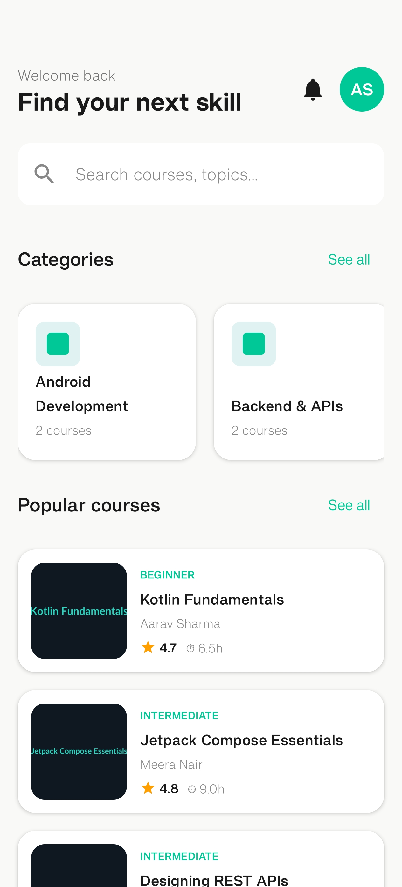
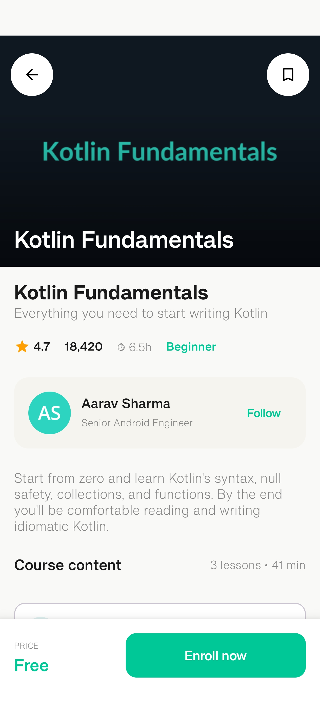
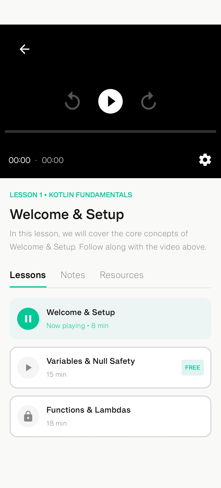

# Skillforge - Professional Learning Android App

Skillforge is a modern, high-fidelity learning application built for Android using a browse-to-learn flow. The app demonstrates professional Android development practices, including clean architecture, declarative UI with Jetpack Compose, and robust video streaming capabilities.

## 📱 Screenshots

| Home Screen | Course Detail | Lesson Player |
| :---: | :---: | :---: |
|  |  |  |
| *Browse categories and popular courses* | *Explore course content and instructors* | *Immersive video learning experience* |

*(Note: Replace placeholders with actual screenshots from your device)*

## ✨ Features

- **Home Screen**: 
    - Personalised welcome header with user profile.
    - Search functionality for courses and topics.
    - Horizontal scrolling categories with course counts.
    - Vertical list of popular courses featuring thumbnails, ratings, and difficulty levels.
- **Course Detail Screen**:
    - High-quality hero image with brand-consistent gradients.
    - Detailed course metadata (rating, student count, duration, level).
    - Instructor profile card with "Follow" functionality.
    - Interactive course content list distinguishing between "Free" and "Locked" lessons.
- **Lesson Player Screen**:
    - Full-featured video player using **Android Media3 (ExoPlayer)**.
    - Adaptive UI that highlights the currently playing lesson.
    - Tabbed interface for Lessons, Notes, and Resources.
    - Automatic playback and clean state management between transitions.
- **Robust Data Handling**:
    - Real-time data fetching from a remote JSON API.
    - Graceful handling of loading states and network errors.
    - Image caching and optimization using Coil.

## 🛠 Tech Stack

- **Language**: Kotlin
- **UI Framework**: Jetpack Compose (Modern Declarative UI)
- **Networking**: Retrofit & Gson (REST API Consumption)
- **Image Loading**: Coil (Image Caching & Processing)
- **Video Playback**: Android Media3 ExoPlayer (High-performance streaming)
- **Navigation**: Jetpack Compose Navigation
- **Architecture**: MVVM (Model-View-ViewModel) + Repository Pattern
- **Dependency Management**: Gradle Version Catalog (libs.versions.toml)

## 🏗 Architecture & Design Patterns

### MVVM (Model-View-ViewModel)
The project follows the MVVM pattern to ensure a clean separation of concerns:
- **Model**: Data classes representing the Skillforge API response.
- **View**: Composable functions that observe state and emit events.
- **ViewModel**: Manages UI state using `StateFlow` and handles business logic/network calls via Coroutines.

### UI State Management
Utilizes a sealed class `UiState` to represent the three main states of the screen:
- `Loading`: Displays a circular progress indicator.
- `Success`: Renders the content with the fetched data.
- `Error`: Shows a user-friendly error message.

## 🚀 Getting Started

### Prerequisites
- Android Studio Ladybug (2024.2.1) or newer.
- Android SDK 35+ (App compiles against SDK 37).
- Active Internet connection (for API data and video streaming).

### Installation
1. Clone this repository:
   
